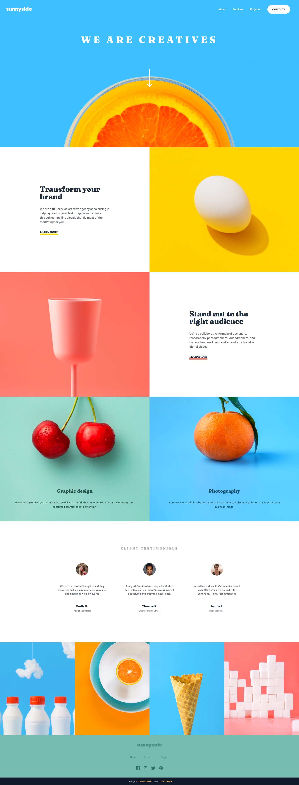

# Frontend Mentor - Sunnyside agency landing page solution

This is a solution to the [Sunnyside agency landing page challenge on Frontend Mentor](https://www.frontendmentor.io/challenges/sunnyside-agency-landing-page-7yVs3B6ef). Frontend Mentor challenges help you improve your coding skills by building realistic projects.

## Table of contents

- [Overview](#overview)
  - [Screenshot](#screenshot)
  - [Links](#links)
- [My process](#my-process)
  - [Built with](#built-with)
  - [What I learned](#what-i-learned)
  - [Continued development](#continued-development)
  - [Useful resources](#useful-resources)
- [Author](#author)

##Overview

### Screenshot

### Links

- Solution URL: [Solution](https://github.com/Knight9876/sunnyshore-agency-landing-page)
- Live Site URL: [Live URL](https://sunnyside-landing-page-tailwind.netlify.app)

## My process

### Built with

- Semantic HTML5 markup
- CSS custom properties
- Flexbox
- CSS Grid
- Mobile-first workflow
- [Tailwind](https://tailwindcss.com) - CSS Library
- JavaScript

### What I learned

- Adjusting images for various screens

### Continued development

- Want to gain in-depth knowledge of Tailwind CSS

### Useful resources

- [Taiwind CSS Docs](https://tailwindcss.com/docs) - I really liked the pattern and will use it going forward.

## Author

- Website - [Yash Kamble](https://yashkamble.netlify.app/)
- Frontend Mentor - [@Knight9876](https://www.frontendmentor.io/profile/Knight9876)
- LinkedIn - [Yash Kamble](https://www.linkedin.com/in/yash-kamble-7ba040245/)
